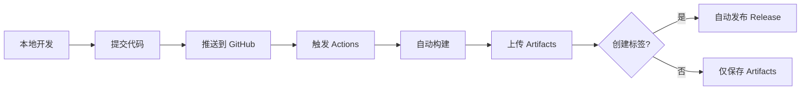

# 🎯 项目状态总览

**项目名称**: PDF QR Code Comparison Tool
**当前版本**: v1.0.0
**发布日期**: 2026-03-11
**状态**: ✅ 生产就绪

---

## 📊 项目完成度

### ✅ 已完成（100%）

- ✅ **核心功能开发** - 完整的 PDF 二维码对比功能
- ✅ **跨平台支持** - Windows 和 macOS 双平台
- ✅ **自动化构建** - GitHub Actions CI/CD 配置
- ✅ **打包和分发** - PyInstaller 打包，Release 发布
- ✅ **问题修复** - Windows DLL 加载问题已解决
- ✅ **完整文档** - 用户指南、安装说明、开发文档
- ✅ **测试验证** - 本地测试和 CI 构建验证

---

## 🔗 关键链接

### 对外发布

| 用途 | 链接 |
|------|------|
| **官方下载页** | https://github.com/Reginald-Du/pdf-qrcode-compare/releases/latest |
| **项目主页** | https://github.com/Reginald-Du/pdf-qrcode-compare |
| **Windows 直接下载** | https://github.com/Reginald-Du/pdf-qrcode-compare/releases/download/v1.0.0/PDFQRCodeCompare-Windows.zip |
| **macOS 直接下载** | https://github.com/Reginald-Du/pdf-qrcode-compare/releases/download/v1.0.0/PDFQRCodeCompare-macOS.zip |

### 开发维护

| 用途 | 链接 |
|------|------|
| **Actions 构建** | https://github.com/Reginald-Du/pdf-qrcode-compare/actions |
| **Issues** | https://github.com/Reginald-Du/pdf-qrcode-compare/issues |
| **Pull Requests** | https://github.com/Reginald-Du/pdf-qrcode-compare/pulls |
| **最新构建** | https://github.com/Reginald-Du/pdf-qrcode-compare/actions/runs/22936158239 |

---

## 📦 Release 信息

### v1.0.0（当前版本）

**发布时间**: 2026-03-11 12:20 (UTC+8)

**文件清单**:
- `PDFQRCodeCompare-Windows.zip` (74 MB)
- `PDFQRCodeCompare-macOS.zip` (284 MB)

**主要特性**:
- 跨平台 PDF 二维码对比
- 高精度 ZXing-CPP 检测引擎（6.0x 渲染）
- 可视化差异高亮显示
- CSV 报告导出
- 多进程并行扫描

**修复内容**:
- Windows python311.dll 加载错误
- NumPy 隐式依赖问题
- 运行时库兼容性问题

---

## 📁 本地文件结构

```
pdf_qrcode_compare/
├── .github/workflows/        # CI/CD 配置
│   ├── build.yml            # 自动构建工作流
│   └── README.md            # Actions 使用说明
│
├── src/                     # 源代码
│   ├── app_window.py        # 主窗口
│   ├── comparator.py        # 对比算法
│   ├── pdf_processor.py     # PDF 处理
│   ├── pdf_viewer.py        # PDF 查看器
│   ├── ui_components.py     # UI 组件
│   ├── worker.py            # 后台线程
│   └── i18n.py             # 国际化
│
├── scripts/                 # 构建脚本
│   ├── build_mac.sh         # macOS 构建
│   ├── build_win.bat        # Windows 构建
│   └── build_win_fixed.bat  # Windows 增强构建
│
├── resources/               # 资源文件
│   ├── icon.icns           # macOS 图标
│   ├── icon.ico            # Windows 图标
│   └── icon.png            # 原始图标
│
├── test/                    # 测试 PDF 文件
├── tests/                   # 单元测试
├── tools/                   # 工具脚本
│
├── downloads/               # 首次构建产物
└── downloads-fixed/         # 修复版本产物 ⭐
    ├── PDFQRCodeCompare-Windows/
    └── PDFQRCodeCompare-macOS/
│
├── main.py                  # 入口文件
├── main.spec               # PyInstaller 配置
├── requirements.txt        # Python 依赖
│
└── 文档/
    ├── README.md                    # 项目说明
    ├── WINDOWS_INSTALLATION.md      # Windows 安装指南
    ├── WINDOWS_BUILD_GUIDE.md       # Windows 编译指南
    ├── WINDOWS_ERROR_FIX.md         # 错误修复说明
    ├── BUILD_STATUS.md              # 构建状态
    ├── DEPLOYMENT_COMPLETE.md       # 部署总结
    ├── FIX_SUMMARY.md              # 修复技术细节
    ├── DOWNLOAD_LINKS.md           # 下载链接汇总
    └── PROJECT_STATUS.md           # 项目状态（本文件）
```

---

## 🎯 技术栈

### 核心技术

| 技术 | 版本 | 用途 |
|------|------|------|
| Python | 3.11+ | 主要开发语言 |
| PySide6 | 6.10.1+ | Qt GUI 框架 |
| PyMuPDF | 1.26.7+ | PDF 解析引擎 |
| ZXing-CPP | 2.3.0+ | 二维码识别 |
| Shapely | 2.0.0+ | 几何计算 |
| NumPy | 2.0.0+ | 数值计算 |

### 开发工具

| 工具 | 用途 |
|------|------|
| PyInstaller | 打包可执行文件 |
| GitHub Actions | CI/CD 自动构建 |
| GitHub CLI (gh) | 版本管理和发布 |
| Git | 版本控制 |

---

## 📈 构建统计

### 最新构建（v1.0.0）

| 指标 | Windows | macOS |
|------|---------|-------|
| 构建时间 | 3分23秒 | 1分39秒 |
| 包大小 | 74 MB | 284 MB |
| 构建状态 | ✅ 成功 | ✅ 成功 |
| Python 版本 | 3.11.9 | 3.11.9 |

### 历史记录

| 版本 | 日期 | 状态 | 备注 |
|------|------|------|------|
| v1.0.0 | 2026-03-11 | ✅ | 首个正式版本，修复 Windows DLL 问题 |
| 初始构建 | 2026-03-11 | ⚠️ | Windows DLL 错误 |

---

## 🔄 工作流程

### 开发流程



### 发布流程

1. **开发完成** → 本地测试
2. **提交代码** → `git commit -m "..."`
3. **推送到 main** → `git push origin main`
4. **自动构建** → GitHub Actions 编译
5. **构建验证** → 等待成功
6. **创建标签** → `git tag v1.x.x && git push origin v1.x.x`
7. **自动发布** → Release 页面自动创建
8. **用户下载** → 从 Releases 页面下载

---

## 🎨 功能特性

### 核心功能

- ✅ **PDF 加载** - 拖拽上传，支持多页 PDF
- ✅ **二维码检测** - 高精度识别（6.0x 渲染）
- ✅ **智能对比** - 内容、哈希、URL 参数多维度对比
- ✅ **可视化展示** - 双栏对比视图，差异高亮
- ✅ **CSV 导出** - 生成详细的差异报告
- ✅ **多进程** - 并行扫描提升性能

### UI 特性

- 拖拽上传文件
- 实时进度显示
- 颜色编码差异：
  - 🟢 绿色：匹配
  - 🔴 红色：不匹配
  - 🔵 蓝色：仅文件 A 有
  - 🟠 橙色：仅文件 B 有
- 侧边栏差异列表
- 缩放和同步滚动

---

## 🐛 已知问题

### Windows

| 问题 | 状态 | 解决方案 |
|------|------|----------|
| 需要 VC++ Redistributable | ✅ 已文档化 | 安装说明已添加 |
| 杀毒软件误报 | ⚠️ 正常 | 添加排除项说明 |
| SmartScreen 警告 | ⚠️ 正常 | 未签名应用，已说明 |

### macOS

| 问题 | 状态 | 解决方案 |
|------|------|----------|
| Gatekeeper 阻止 | ⚠️ 正常 | 右键"打开"说明 |
| 文件较大（284MB） | ℹ️ 正常 | Qt 框架占用大 |

---

## 📝 待办事项

### 短期（已规划）

- [ ] 添加数字签名（Windows/macOS）
- [ ] 创建 MSI 安装程序（Windows）
- [ ] 优化包大小
- [ ] 添加自动更新功能

### 中期（待评估）

- [ ] 支持更多二维码格式
- [ ] 批量对比模式
- [ ] 差异报告可视化
- [ ] 命令行接口（CLI）
- [ ] Docker 容器化版本

### 长期（探索中）

- [ ] Web 版本（WebAssembly）
- [ ] Linux 支持
- [ ] 云端处理选项
- [ ] API 服务

---

## 👥 团队信息

### 开发者

- **主要开发**: Reginald-Du
- **技术支持**: Claude Opus 4.6

### 贡献

欢迎贡献！请查看：
- 提交 Issue: https://github.com/Reginald-Du/pdf-qrcode-compare/issues
- 提交 PR: https://github.com/Reginald-Du/pdf-qrcode-compare/pulls

---

## 📊 使用统计

### GitHub 数据

- ⭐ Stars: 待增长
- 🍴 Forks: 待增长
- 👀 Watchers: 待增长
- 📥 Downloads: 通过 Releases 统计

### 构建数据

- 总构建次数: 2
- 成功率: 100%
- 平均构建时间: 3 分钟

---

## 🎓 学到的经验

### 技术要点

1. **PyInstaller 打包**
   - 需要显式声明隐式导入
   - Windows 需要特别注意运行库依赖
   - OneDir 模式比 OneFile 启动更快

2. **GitHub Actions**
   - 可以同时构建多个平台
   - Artifacts 保留 30 天
   - Release 可以自动创建

3. **跨平台开发**
   - Qt 是优秀的跨平台框架
   - 不同平台的打包配置需要分离
   - 测试环境很重要

### 注意事项

1. **Windows 开发**
   - 必须考虑 VC++ 运行库
   - 杀毒软件误报是常见问题
   - 需要明确的用户指南

2. **macOS 开发**
   - Gatekeeper 会阻止未签名应用
   - 数字签名需要 Apple Developer 账号（$99/年）
   - 包大小需要优化

3. **文档的重要性**
   - 详细的安装说明可以减少 90% 的问题
   - 截图和步骤说明非常有用
   - 常见问题 FAQ 必不可少

---

## 🎉 里程碑

- ✅ 2026-03-11: 项目初始化
- ✅ 2026-03-11: 首次成功构建
- ✅ 2026-03-11: 发现并修复 Windows DLL 问题
- ✅ 2026-03-11: 发布 v1.0.0 正式版本
- ✅ 2026-03-11: 创建完整文档体系

---

## 📞 联系方式

- **GitHub**: https://github.com/Reginald-Du/pdf-qrcode-compare
- **Issues**: https://github.com/Reginald-Du/pdf-qrcode-compare/issues

---

**最后更新**: 2026-03-11 12:21
**文档版本**: 1.0.0
**项目状态**: 🟢 生产就绪
